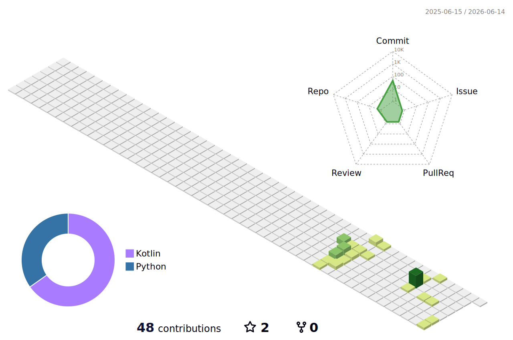

# **Hello everyone! 👋**

> ### **introductions:**
<!-- introductions:START -->
Hello, I'm Han Man-yong, an Android developer.

Based on my understanding and experience of Android development, I developed it using Java and Kotlin languages, and I have been developing more efficiently by implementing user-friendly UI based on understanding design patterns and using various libraries.

My ultimate goal is to find issues first, acquire technology and the latest trends, and develop such apps that users look for first by prioritizing app performance optimization.

We are working hard to develop user-friendly systems such as smart home system development and e-commerce, and to develop them to increase performance.

- 💬 ask me about anything [email](mailto:h01037742486@gmail.com) :)
<!-- introductions:END -->
 

> ### 📊 **My Github Stats:**

 

