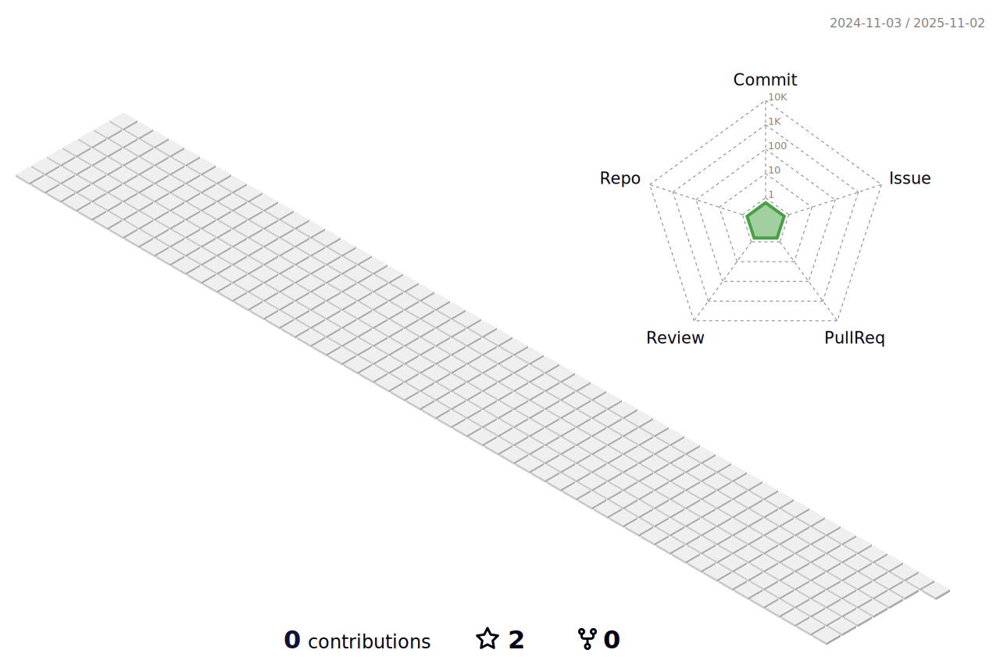

# **Hello everyone! 👋**

> ### **introductions:**
<!-- introductions:START -->
Hello, I'm Han Man-yong, an Android developer.

Based on my understanding and experience of Android development, I developed it using Java and Kotlin languages, and I have been developing more efficiently by implementing user-friendly UI based on understanding design patterns and using various libraries.

My ultimate goal is to find issues first, acquire technology and the latest trends, and develop such apps that users look for first by prioritizing app performance optimization.

We are working hard to develop user-friendly systems such as smart home system development and e-commerce, and to develop them to increase performance.


- 💬 ask me about anything [email](mailto:h01037742486@gmail.com) :)
<!-- introductions:END -->

<br/>

> ### 💻 **Languages and Tools:**
<!-- Languages and Tools:START -->
<code></code>
<code></code>
<code></code>
<code></code>
<code></code>
<!-- Languages and Tools:END -->

<br/>

> ### 🛠️ **Detailed Information on Applicable Skills:**

<!-- Skills:START -->
|등급|입문|초급|중급|고급|
|:---:|:---:|:---:|:---:|:---:|
|**설명**|1회이상 경험|어느정도 학습|코드보고 이해|응용해서 구현|
|**Level**|1-3|4-5|6-7|8-10|
|**%**|0-25|25-50|50-75|75-100|
```py
java           ██████████████████████░░░   Lv. 8(85%)
kotlin         █████████████████████░░░░   Lv. 8(80%)
Android Studio ███████████████████████░░   Lv. 9(90%)
Notion         ███████████████████░░░░░░   Lv. 7(75%)
GitHub         █████████████████████░░░░   Lv. 8(80%)
```
<!-- Skills:END -->

<br/>

> ### 🏆 **My Certificate:**

<!-- Certificate:START -->
💻  정보처리기사      
💻  컴퓨터활용능력 1급
<!-- Certificate:END -->

<br/>

> ### 📊 **My Github Stats:**


<br/>



